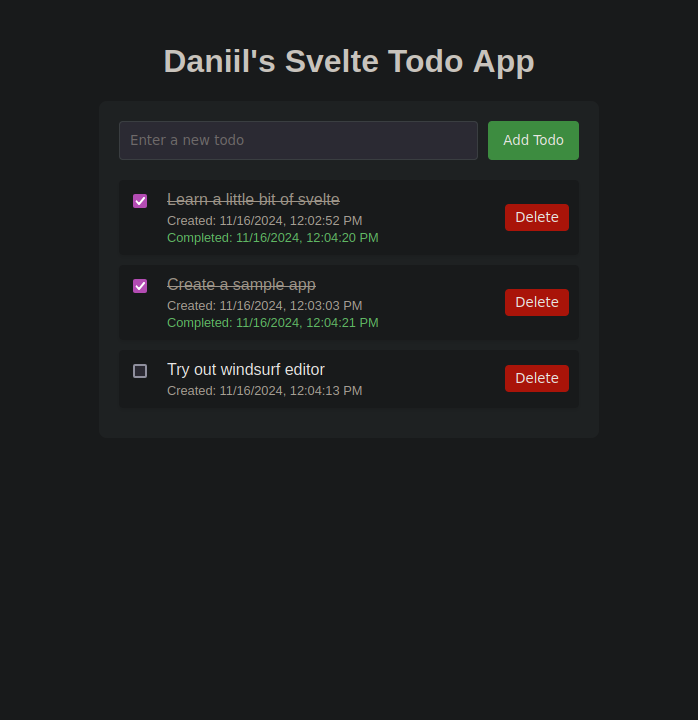

# Svelte Todo App

A simple and elegant todo application built with Svelte and Vite.



## Features

- Add new todos
- Mark todos as complete
- Delete todos
- Local storage persistance
- Responsive design

## Getting Started

### Prerequisites

- Node.js (v14 or later)
- npm

### Installation

1. Clone the repository
2. Install dependencies:
   ```bash
   npm install
   ```

### Running the App

- Development mode:
  ```bash
  npm run dev
  ```

- Build for production:
  ```bash
  npm run build
  ```

## Project Structure

- `src/App.svelte`: Main application component
- `src/lib/TodoList.svelte`: Todo list management component
- `src/lib/TodoItem.svelte`: Individual todo item component

## Technologies

- Svelte
- Vite
- JavaScript

## License

MIT License
